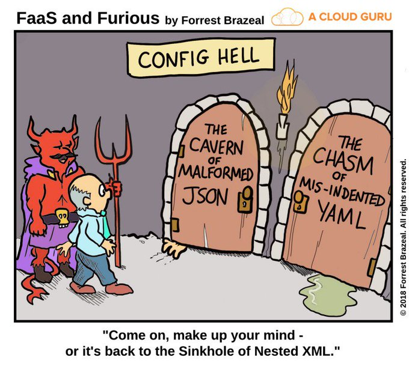

# Lab 102: A glimpse of config hell

This Lab is based on Lab 101 and adds a second application to `SampleTenant` and an additional tenant `AnotherTenant`.

Two tenants, and three applications total turn out to be ~ 250 lines of YAML. Admitted, the Certificates + Keys take a chunk of it (~150 lines), but it still shows that this technique is more suited for smaller deployments and will not scale well for a couple of hundred applications, neither with JSON nor YAML.

Inevitably we might get caught in config hell:

Let's see if we can evade config hell (Lab 103)!

# [<< Return to Lab 101](../101) &nbsp;&nbsp;&nbsp;&nbsp;&nbsp;&nbsp;&nbsp;&nbsp; [Proceed to Lab 103 >>](../103)
